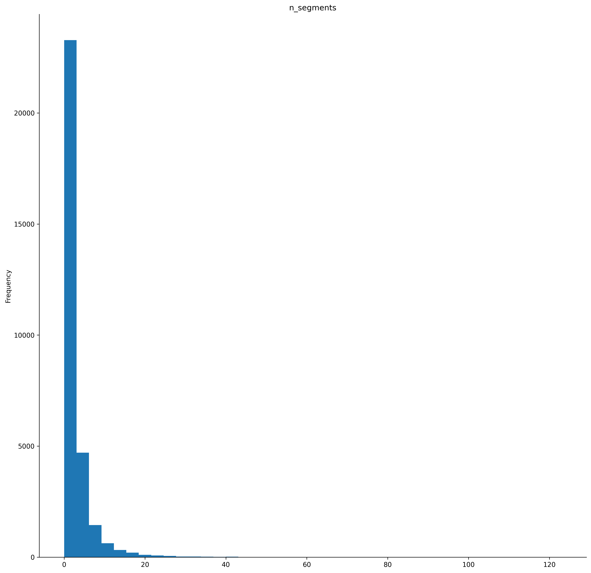

# Natural street analysis and power law fitting 


## Features

- uses polygon delineating city borders to extract OSM road data
- performs natural street analysis (segments are calculated with deflection angle) and number of connecting streets is determined for each segment
- calculates head/tail distribution of these streets
- fit the distribution to a power law

## Requirements

The following Python libraries are required to run the code:

- `geopandas`
- `matplotlib`
- `powerlaw`
- `shapely`
- `osmnx` (optional, depending on your data processing needs)

You can install these dependencies using:

```bash
pip install geopandas matplotlib powerlaw shapely osmnx
```

## Usage

1. **Load a Shapefile**
   Ensure your shapefile contains geometries (one polygon representing each city) and name of city for each geometry in the attribute table

2. **Run the Script**
   Update the script with the path to your shapefile and output folder. The key steps include:

   - Downloading OSM street data inside the shape file polygons
   - Calculating natural streets and their connectivity
   - Calculating head/tail distribution for the streets
   - Fitting a power-law distribution to the calculated degree values.
   - Saving the resulting plots to the specified folder.

3. **Output**
   - Processed GeoDataFrame with valid geometries and connection counts.
   - Power-law fit parameters (`alpha`, `xmin`) and comparison metrics.
   - Shape file for natural streets, png of the streets, pnf of the histogram, png of the power law fit

## Example Plot




## License

This project is licensed under the MIT License. See the [LICENSE](LICENSE) file for details.

## Contribution

Feel free to submit issues or pull requests if you find bugs or want to add new features.

---

